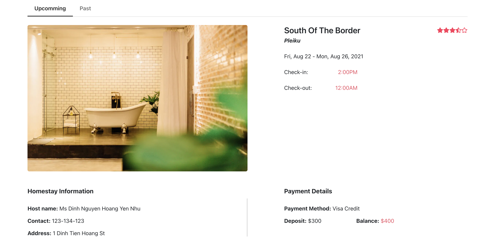

# Faith Travel

### Feel at home, no matter where you are.

Guests can explore the perfect place with the ideal price to stay for every getaway. Hosts can share their world, receive hosting tips and earn money while creating memorable moments for guests.

### Guests can use the Faith Travel app to:

- Your next solo journey or family vacation become exciting when booking vacation rentals through Faith Travel.

- Create your homestay wishlist for enjoyable holidays

- Track your itinerary

- Message your host for directions, assistance, and helpful tips

### Hosts can take advantage of the Faith Travel app to:

- Share your extra home space through the vacation rental platform.

- Share what’s special about your city with a host guidebook

- Message guests and manage their reservations

- Make friends and create memoriable moments with guests

### Special screenshots

  
<i>Wishlist</i>

    

    <kbd>
    
    </kbd>
    

   
  
<i>Upcomming Trips</i>

    

    <kbd>
    
    </kbd>
    

   
  
<i>Detailed Upcomming Trip</i>

    

    <kbd>
    
    </kbd>
    

   
  
<i>Top Valuable Reviews</i>

    

    <kbd>
    
    </kbd>
    

   
  
<i>Other feedbacks</i>

    

    <kbd>
    
    </kbd>
    

### Framework

- [React JS](https://reactjs.org/)
- Libs:
  - [React Router](https://reactrouter.com/web/guides/quick-start)
  - [Boostraps 4](https://getbootstrap.com/docs/4.0/getting-started/introduction/)

### Tools:

- Visual Studio Code
- Figma: design UI & UX.
- GitHub: store source code of the whole project.

### Contributors:

- Pham Ngoc Thinh - ID: 18520368 - email: 18520368@gm.uit.edu.vn
- Dinh Ngoc Uyen Phuong - ID: 18520335 - email: 18520335@gm.uit.edu.vn